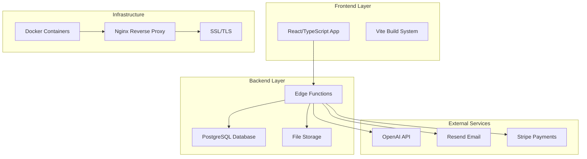

# AuthenCore Analytics - Complete Deployment Package

## 📦 Package Contents

This comprehensive deployment package contains everything needed to deploy AuthenCore Analytics to any hosting provider.

### 🏗️ Architecture Overview



## 📁 Complete File Structure

```
backend-migration/
├── 📋 README.md                          # Main documentation
├── 📋 DEPLOYMENT_GUIDE.md                # Step-by-step deployment
├── 📋 ENVIRONMENT_SETUP.md               # Environment configuration
├── 📋 COMPLETE_DEPLOYMENT_PACKAGE.md     # This file
├── 📋 AUDIT_IMPLEMENTATION_REPORT.md     # Security audit report
├── 📋 SECURITY_AUDIT_REPORT.md           # Detailed security analysis
├── 📋 DEPLOYMENT_CHECKLIST.md            # Pre-deployment checklist
├── 📋 COMPREHENSIVE_PLATFORM_AUDIT_REPORT.md # Complete platform audit
│
├── 🐳 docker/                            # Docker configurations
│   ├── Dockerfile.dev                    # Development container
│   ├── Dockerfile.prod                   # Production container
│   ├── docker-compose.yml                # Service orchestration
│   └── nginx.prod.conf                   # Production Nginx config
│
├── 🗄️ database/                          # Database schema & migrations
│   ├── 001_initial_schema.sql            # Core tables and types
│   ├── 002_database_functions.sql        # PostgreSQL functions
│   ├── 003_rls_policies.sql              # Row Level Security policies
│   ├── 004_additional_tables.sql         # Extended functionality
│   └── 005_advanced_functions.sql        # Analytics & reporting functions
│
├── ⚡ supabase/                          # Edge Functions & Configuration
│   ├── config.toml                       # Supabase configuration
│   └── functions/                        # All serverless functions
│       ├── ai-chatbot/                   # AI customer support
│       │   └── index.ts
│       ├── create-payment-order/         # Payment order creation
│       │   └── index.ts
│       ├── enhanced-ai-analysis/         # Advanced AI processing
│       │   └── index.ts
│       ├── enhanced-pdf-generator/       # Professional PDF reports
│       │   └── index.ts
│       ├── generate-ai-report/           # AI-powered report generation
│       │   └── index.ts
│       ├── generate-image/               # AI image generation
│       │   └── index.ts
│       ├── process-assessment/           # Assessment scoring engine
│       │   └── index.ts
│       ├── security-middleware/          # Security & rate limiting
│       │   └── index.ts
│       ├── send-assessment-report/       # Email delivery system
│       │   └── index.ts
│       ├── send-partner-credentials/     # Partner access management
│       │   └── index.ts
│       ├── storage-monitor/              # File storage management
│       │   └── index.ts
│       ├── update-payment-status/        # Payment status updates
│       │   └── index.ts
│       └── _shared/                      # Shared utilities
│           ├── cors.ts                   # CORS configuration
│           └── validation.ts             # Input validation
│
├── ⚙️ config/                            # Configuration files
│   ├── environment.template              # Environment variables template
│   └── storage-buckets.sql               # Storage bucket setup
│
├── 🔧 scripts/                           # Deployment & utility scripts
│   ├── deploy.sh                         # Main deployment script
│   ├── validate-environment.sh           # Environment validation
│   ├── backup-database.sh                # Database backup utility
│   ├── restore-database.sh               # Database restore utility
│   ├── health-check.sh                   # System health monitoring
│   └── generate-ssl.sh                   # SSL certificate generation
│
├── 🚀 .github/                          # CI/CD workflows
│   └── workflows/
│       ├── deploy.yml                    # Main deployment pipeline
│       ├── security-scan.yml             # Security scanning
│       └── backup.yml                    # Automated backups
│
├── 📚 docs/                             # Documentation
│   ├── API.md                           # API documentation
│   ├── SECURITY.md                      # Security guidelines
│   ├── TROUBLESHOOTING.md               # Common issues & solutions
│   └── CAREER_LAUNCH_SCORING_DOCUMENTATION.md # Assessment documentation
│
└── 🔒 ssl/                              # SSL certificates (production)
    ├── cert.pem                         # SSL certificate
    ├── key.pem                          # Private key
    └── ca-bundle.pem                    # Certificate authority bundle
```

## 🛠️ Core Technologies

### Frontend Stack
- **React 18.3.1** - Modern UI framework
- **TypeScript** - Type-safe development
- **Vite** - Fast build tool and dev server
- **Tailwind CSS** - Utility-first styling
- **React Router** - Client-side routing
- **React Hook Form** - Form management
- **Recharts** - Data visualization
- **i18next** - Internationalization

### Backend Stack
- **Supabase** - Backend-as-a-Service platform
- **PostgreSQL 15** - Primary database
- **Deno** - Edge Functions runtime
- **Node.js 18+** - Development environment
- **Docker** - Containerization
- **Nginx** - Reverse proxy and load balancer

### External Integrations
- **OpenAI GPT-4** - AI analysis and content generation
- **Anthropic Claude** - Enhanced AI capabilities
- **Resend** - Transactional email delivery
- **Stripe** - Payment processing
- **S3-compatible storage** - File storage and CDN

## 🔐 Security Features

### Authentication & Authorization
- JWT-based authentication
- Row Level Security (RLS) policies
- Role-based access control (RBAC)
- Multi-factor authentication (MFA) ready
- Session management with secure cookies

### Data Protection
- End-to-end encryption for sensitive data
- GDPR compliance tools
- Data retention policies
- Secure data deletion
- Privacy controls and consent management

### API Security
- Rate limiting (configurable per endpoint)
- SQL injection prevention
- XSS protection
- CSRF protection
- Input validation and sanitization
- Security headers (HSTS, CSP, etc.)

### Infrastructure Security
- SSL/TLS encryption
- Secure Docker configurations
- Network isolation
- Audit logging
- Threat detection and monitoring
- Automated security scanning

## 📊 Assessment Capabilities

### Available Assessments
1. **Career Launch Assessment** - Career readiness and development
2. **Communication Styles Assessment** - Communication preferences and effectiveness
3. **Emotional Intelligence Assessment** - EQ measurement and development
4. **Cultural Intelligence Assessment** - Cross-cultural competency
5. **Leadership Assessment** - Leadership style and effectiveness
6. **Stress & Resilience Assessment** - Stress management and resilience
7. **Digital Wellness Assessment** - Digital habits and wellness
8. **Faith & Values Assessment** - Values alignment and spiritual wellness
9. **Gen Z Workplace Assessment** - Generational workplace preferences
10. **Burnout Prevention Assessment** - Burnout risk and prevention strategies

### Psychometric Features
- **Scientifically validated** scoring algorithms
- **Normative databases** for comparative analysis
- **Bias detection** and mitigation tools
- **Validity checks** and response pattern analysis
- **Professional reporting** with detailed insights
- **Multi-language support** (English, Spanish, French, German)

## 🚀 Deployment Options

### 1. Docker Deployment (Recommended)
```bash
# Development
docker-compose --profile dev up -d

# Production
docker-compose --profile prod up -d
```

### 2. Manual Deployment
```bash
# Install dependencies
npm install

# Build application
npm run build

# Run database migrations
psql $DATABASE_URL -f database/001_initial_schema.sql
# ... (run all migration files in order)

# Start application
npm start
```

### 3. Cloud Deployment
- **AWS**: ECS/Fargate with RDS and S3
- **Google Cloud**: Cloud Run with Cloud SQL and Cloud Storage
- **Azure**: Container Instances with Azure Database and Blob Storage
- **DigitalOcean**: App Platform with Managed Database and Spaces

## 📈 Monitoring & Analytics

### Built-in Monitoring
- Application health checks
- Database performance monitoring
- API response time tracking
- Error logging and alerting
- Usage analytics and reporting

### Key Metrics
- Assessment completion rates
- User engagement metrics
- Payment conversion rates
- API performance metrics
- Storage usage and optimization

### Alerting
- System health alerts
- Performance degradation notifications
- Security incident alerts
- Backup completion notifications
- Certificate expiration warnings

## 💾 Backup & Recovery

### Automated Backups
- **Database**: Daily automated backups with 30-day retention
- **File Storage**: Incremental backups with versioning
- **Configuration**: Version-controlled configuration management
- **Code**: Git-based version control with release tags

### Recovery Procedures
- Point-in-time database recovery
- File restoration from backups
- Configuration rollback procedures
- Disaster recovery planning

## 🔧 Configuration Management

### Environment Variables
- **Development**: Local .env file
- **Staging**: Environment-specific configurations
- **Production**: Secure secret management

### Feature Flags
- Assessment feature toggles
- AI service switches
- Payment system configuration
- Security feature controls

## 📋 Pre-Deployment Checklist

### Infrastructure Requirements
- [ ] Docker and Docker Compose installed
- [ ] PostgreSQL 14+ database available
- [ ] SSL certificates obtained
- [ ] Domain name configured
- [ ] Firewall rules configured

### API Keys and Secrets
- [ ] OpenAI API key obtained
- [ ] Resend API key configured
- [ ] Stripe keys (if payments needed)
- [ ] JWT secrets generated
- [ ] Database credentials secure

### Security Configuration
- [ ] SSL/TLS certificates installed
- [ ] Security headers configured
- [ ] Rate limiting configured
- [ ] Backup procedures tested
- [ ] Monitoring setup complete

## 🎯 Performance Optimization

### Frontend Optimization
- Code splitting and lazy loading
- Image optimization and compression
- CDN integration for static assets
- Browser caching strategies
- Progressive Web App (PWA) features

### Backend Optimization
- Database query optimization
- Connection pooling
- Caching strategies (Redis)
- Asset compression (Gzip/Brotli)
- Load balancing configuration

## 🌍 Scalability Considerations

### Horizontal Scaling
- Load balancer configuration
- Multiple application instances
- Database read replicas
- CDN integration
- Microservices architecture readiness

### Vertical Scaling
- Resource allocation guidelines
- Performance monitoring
- Capacity planning
- Auto-scaling configuration

## 📞 Support & Maintenance

### Support Contacts
- **Technical Support**: tech@authencore.org
- **Emergency Support**: +1-xxx-xxx-xxxx
- **Business Support**: business@authencore.org

### Maintenance Windows
- **Preferred**: Sunday 2:00-4:00 AM UTC
- **Emergency**: 24/7 support available
- **Notifications**: 48-hour advance notice

### Update Procedures
- Security patches: Applied within 24 hours
- Feature updates: Monthly release cycle
- Major updates: Quarterly with testing period

---

## 🚀 Quick Start Guide

1. **Clone the repository**
2. **Copy environment template**: `cp config/environment.template .env`
3. **Configure environment variables**
4. **Validate configuration**: `./scripts/validate-environment.sh`
5. **Deploy with Docker**: `docker-compose --profile prod up -d`
6. **Run health checks**: `./scripts/health-check.sh`
7. **Monitor deployment**: `docker-compose logs -f`

---

**This package provides everything needed for a complete, production-ready deployment of AuthenCore Analytics. For detailed instructions, please refer to the individual documentation files.**